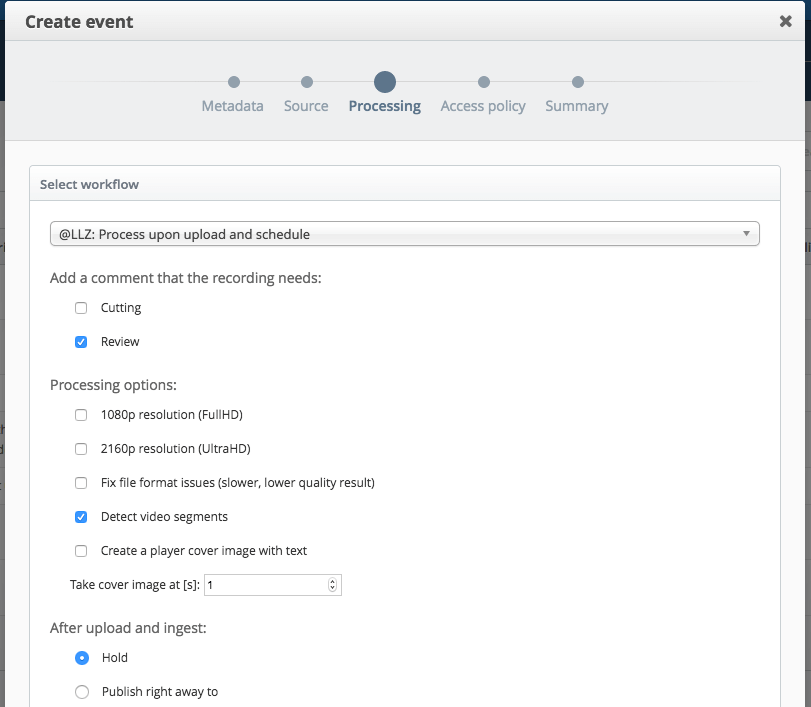

These are basically the default Opencast workflows with the following amendments:

- Our customer is called @LLZ
- Parallel encoding of 4 or 5 qualities, FullHD and UHD options,
  separate encoding of UHD video if selected
- Option for videos with CTTS invalid ("Fix file format issues")
  Bei kaputten Videos schlägt die Erstellung von Vorschaubildern fehl
  und die erzeugten Video-Dateien haben keinen Bildkanal
  (missing video stream)
- Add segmentation option ("Detect video segments")
  Not all videos should be segmented; for instance some lecturers show
  many videos within their presentation
- Optional Player Cover Image ("Create a player cover image with text")
  User can select whether player cover image with text is created and
  from which time
- Flag for review by default
- Error Workflow: Store archive-tagged material
  During processing some material is tagged for archival, however
  was not stored by the Error Workflow that is invoked in case an
  error occured during normal processing (with Error Workflow
  Operation Handler set) of a Workflow Instance

