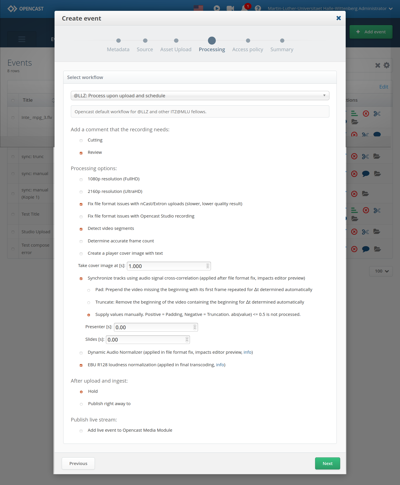

These are basically the default Opencast workflows with the following amendments:

- Customer is called @LLZ
- Flag for review by default
- Parallel encoding of 4 or 5 qualities, FullHD and UHD options,
  separate encoding of UHD video if selected
- Option for videos with CTTS invalid ("Fix file format issues with
  recorder")
  Bei kaputten Videos schlägt die Erstellung von Vorschaubildern fehl
  und die erzeugten Video-Dateien haben keinen Bildkanal
  (missing video stream)
- Borrow Opencast Studio framerate fix ("Fix file format issues with
  Opencast Studio recording"), which when ticked will be used to
  recode the video instead of the ("Fix file format issues with
  recorder")
- Add segmentation option ("Detect video segments")
  Not all videos should be segmented; for instance some lecturers show
  many videos within their presentation
- Optional Player Cover Image ("Create a player cover image with text")
  User can select whether player cover image with text is created and
  from which time
- Option to synchronize presenter with presentation by audio signal
  (sometimes recorders do not start simultaneously); for this to work,
  refer to executables/sync.py (Requires at least Python 3.5, Praat and
  ffmpeg >= 4.2; sync.py must be in commands.allowed list in the Execute
  Service configuration; sync.py must be in $PATH; crosscorrelate.praat
  must be in the same dir as praat)
- Option for dynamic loudness normalization before generating preview/
  editor assets (waveform, preview video)
- Default option for single-pass loudness normalization with EBU R128
  suggested values
- Error Workflow: Store archive-tagged material
  During processing some material is tagged for archival, however
  was not stored by the Error Workflow that is invoked in case an
  error occured during normal processing (with Error Workflow
  Operation Handler set) of a Workflow Instance

